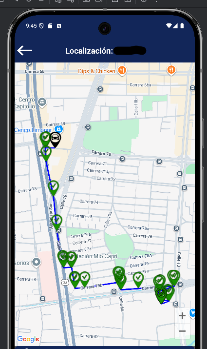

# MapSnippet - Este es un ejemplo de uso de Google Maps en Android Studio

Este repositorio contiene un fragmento de código en Java que muestra cómo agregar marcadores y polilíneas en un mapa de Google Maps dentro de una aplicación Android.

El código está simplificado y sirve como ejemplo práctico para mostrar habilidades en el uso de Google Maps API en Android Studio.

---

## 📌 Características

- Limpia el mapa antes de agregar nuevos marcadores.  
- Dibuja una polilínea con los puntos recorridos.  
- Coloca un marcador rojo en la ubicación inicial y marcadores verdes en las siguientes posiciones.  
- Centra el mapa automáticamente en el primer punto.  
- Sin ventanas de información (InfoWindows), solo se manejan los marcadores.

---

##Vista de ejemplo

Ejemplo visual del resultado en la aplicación:  

---

##Estructura del repositorio
